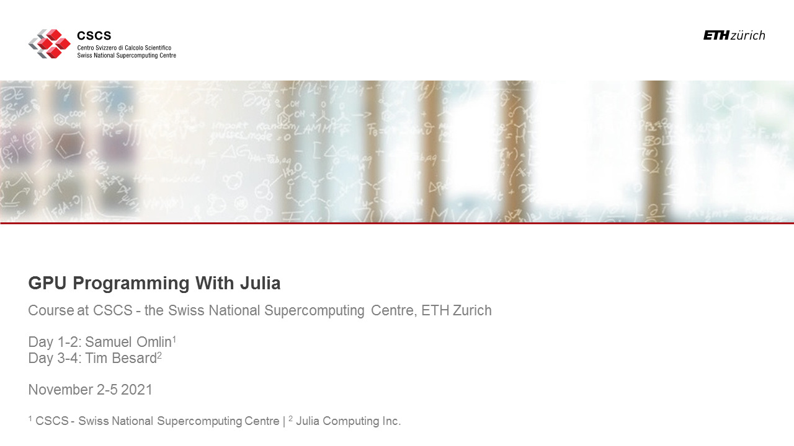

# Course Description

The programming language Julia is being more and more adopted in High Performance Computing (HPC) due to its unique way to combine performance with simplicity and interactivity, enabling unprecedented productivity in HPC development. This course will discuss both basic and advanced topics relevant for single and Multi-GPU computing with Julia. It will focus on the CUDA.jl package, which enables writing native Julia code for GPUs. Topics covered include the following:

-    GPU array programming;
-    GPU kernel programming;
-    kernel launch parameters;
-    usage of on-chip memory;
-    Multi-GPU computing;
-    code reflection and introspection; and
-    diverse advanced optimization techniques.

This course combines lectures and hands-on sessions.

# Target audience

This course addresses scientists interested in doing HPC using Julia. Previous Julia or GPU computing knowledge is not needed, but a good general understanding of programming is advantageous.

# Instructors

- Dr. Tim Besard (Lead developer of CUDA.jl, Julia Computing Inc.)
- Dr. Samuel Omlin (Computational Scientist | Responsible for Julia computing, CSCS)

# Repository content

This git repository contains the material of day 1 and 2 of the course *GPU Programming With Julia*, hold November 2-5 virtually at CSCS - the Swiss National Supercomputing Centre, ETH Zurich (speaker: Dr. Samuel Omlin, CSCS)

The material of day 3 and 4 is found in [this git repository](https://github.com/maleadt/cscs_gpu_course/) (speaker: Dr. Tim Besard, Julia Computing Inc.).

# Course recordings
The course recordings will be linked here after editing.
